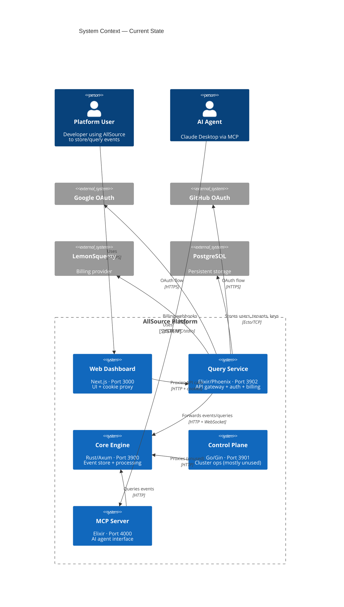
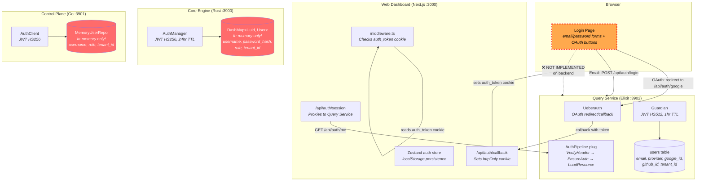
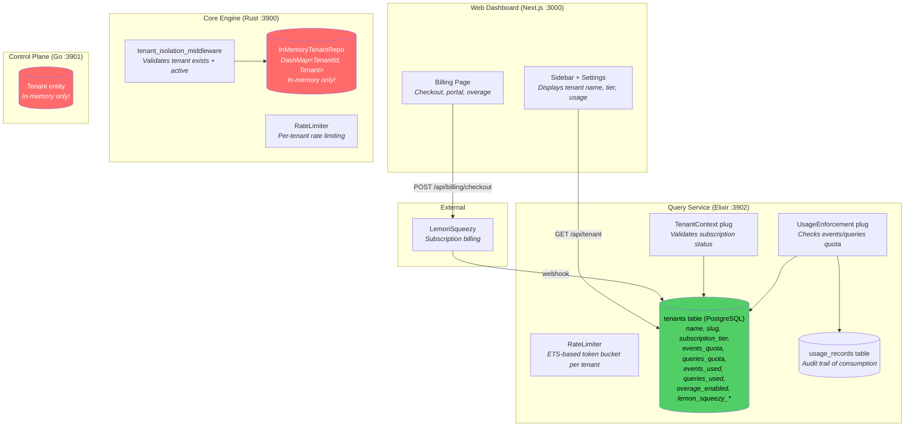
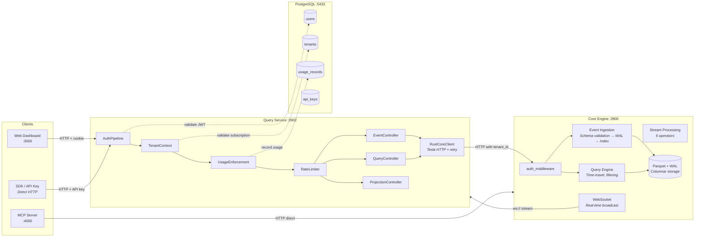
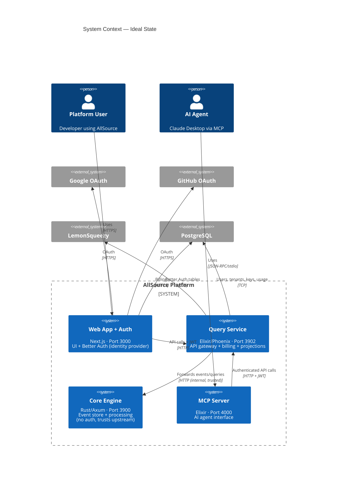
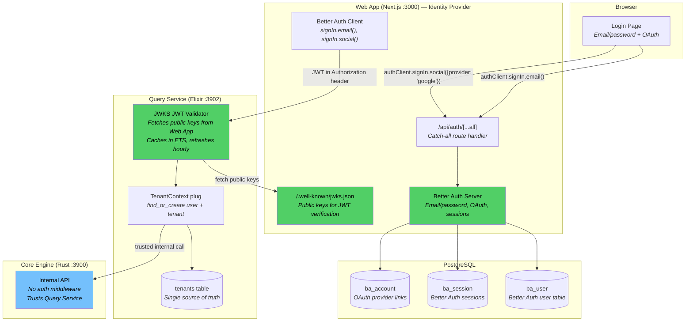
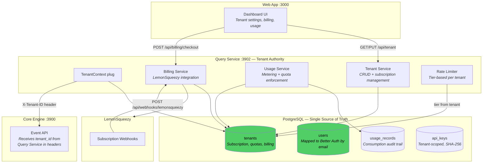
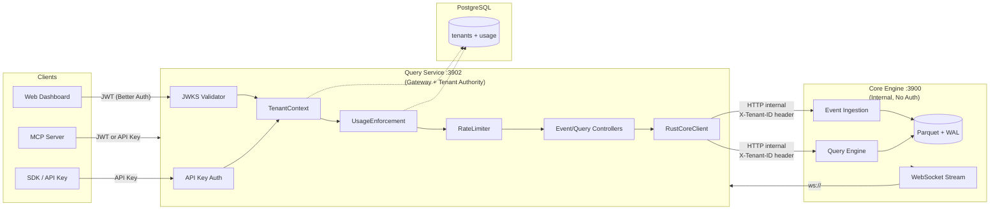

# AllSource Architecture Review

## Executive Summary

AllSource is a polyglot event sourcing platform with 5 services. This review identifies **3 disconnected auth stores**, **3 disconnected tenant stores**, and **broken email/password auth** as the primary architectural issues. The data flow for events is well-designed, but the identity and tenant management layers need consolidation.

---

## 1. Current State — System Context (C4 Level 1)

---

## 2. Current State — Container Diagram (C4 Level 2)

### 2a. Authentication & Identity Flow

**Key Problems:**
- **3 separate user/tenant stores** that never sync (Core and Control Plane user/tenant metadata is in-memory, lost on restart — note: this refers to user/tenant data only, NOT event storage which is durable via WAL + Parquet)
- **Email/password login is broken** — frontend forms exist, backend only handles OAuth
- Core and Control Plane each maintain their own JWT signing with different secrets
- No cross-service token validation possible

### 2b. Tenant Management Flow

**Key Problems:**
- **Query Service PostgreSQL** is the only persistent user/tenant store (green) — source of truth for billing and auth
- **Core has its own in-memory tenant store** (red) — not synced with Query Service
- **Control Plane has its own tenant entity** (red) — not synced
- When Query Service forwards events to Core, tenant_id is passed as a parameter but Core doesn't validate it against Query Service's tenant store

### 2c. Event Data Flow

**This flow is well-designed.** The pipeline is: Auth → Tenant → Quota → Rate Limit → Controller → Core. The concern is the double-auth: Query Service validates its JWT, then Core has its own auth middleware (bypassed in dev mode).

---

## 3. Service Responsibility Matrix

| Responsibility | Web (Next.js) | Query Service (Elixir) | Core (Rust) | Control Plane (Go) | MCP Server (Elixir) |
|---|---|---|---|---|---|
| **User Authentication** | Cookie proxy | Ueberauth + Guardian (OAuth JWT) | AuthManager (username/password JWT) | AuthClient (JWT) | None |
| **User Store** | None (Zustand cache) | PostgreSQL (persistent) | DashMap (in-memory) | Map (in-memory) | None |
| **Tenant Store** | None (Zustand cache) | PostgreSQL (persistent) | DashMap (in-memory) | Struct (in-memory) | None |
| **Tenant Billing** | UI only | LemonSqueezy integration | None | None | None |
| **Usage Metering** | UI only | PostgreSQL + atomic counters | None | None | None |
| **Rate Limiting** | None | ETS token bucket | Per-tenant rate limiter | None | None |
| **Event Storage** | None | Proxy to Core | Parquet + WAL (primary) | None | None |
| **Event Querying** | UI only | DSL + proxy to Core | Arrow columnar engine | None | MCP tools |
| **Projections** | UI only | GenServer-based | Pipeline processing | None | None |
| **Schema Registry** | None | Proxy to Core | JSON Schema validation | None | None |
| **API Key Management** | UI only | PostgreSQL + SHA-256 | DashMap (in-memory) | None | None |
| **RBAC** | None | Subscription tier | Role-based (4 roles) | Role-based (4 roles) | None |
| **Observability** | None | Phoenix telemetry | /metrics endpoint | OTLP + audit log | None |

### Duplicated Responsibilities (Issues)

| Duplicated Concern | Services | Problem |
|---|---|---|
| **Auth/Identity** | Query Service, Core, Control Plane | 3 different JWT implementations, 3 user stores, no sync |
| **Tenant Management** | Query Service, Core, Control Plane | 3 tenant stores, only Query Service is persistent |
| **API Key Management** | Query Service, Core | 2 independent key stores, different formats |
| **Rate Limiting** | Query Service, Core | 2 independent rate limiters, not coordinated |
| **RBAC** | Core, Control Plane | Both define identical 4-role system independently |

---

## 4. Ideal State — System Context (C4 Level 1)

**Key changes from current state:**
1. **Control Plane removed** — its responsibilities folded into Query Service and Core
2. **Web App becomes the identity provider** (Better Auth or similar)
3. **Core drops auth** — trusts internal network, Query Service handles access control
4. **MCP Server routes through Query Service** instead of hitting Core directly (gets tenant isolation)

---

## 5. Ideal State — Container Diagram (C4 Level 2)

### 5a. Unified Authentication Flow

**Benefits:**
- **Single identity provider** (Better Auth in Web App)
- **JWKS-based validation** — no shared secrets between services
- **Email/password works** — Better Auth handles it natively
- **OAuth consolidated** — Better Auth handles Google/GitHub
- **Core simplified** — no auth complexity, trusts internal network

### 5b. Unified Tenant Management Flow

**Benefits:**
- **Single tenant authority** — Query Service + PostgreSQL
- **Core receives tenant_id** as a trusted header, doesn't store tenants
- **No tenant duplication** across services
- **Billing, quotas, usage** all in one place

### 5c. Ideal Event Data Flow

**Key improvement:** Single entry point (Query Service) for all clients. Core is an internal service only.

---

## 6. Migration Path: Current → Ideal

### Phase 1: Consolidate Auth (High Priority)
1. Add Better Auth to Web App (email/password + OAuth + JWKS)
2. Add JWKS JWT validation to Query Service (replace Guardian)
3. Keep Guardian as fallback during migration
4. **Outcome:** Working email/password login, single identity provider

### Phase 2: Simplify Core Auth (Medium Priority)
1. Remove AuthManager from Core (users, JWT, API keys)
2. Core trusts internal network — only accepts requests from Query Service
3. Add network-level isolation (Docker network, no public exposure)
4. **Outcome:** Core is simpler, no auth duplication

### Phase 3: Remove Control Plane (Medium Priority)
1. Move audit logging to Query Service (already has usage_records)
2. Move cluster status endpoint to Core's existing /health
3. Delete Control Plane service entirely
4. **Outcome:** One fewer service to maintain, no orphaned auth store

### Phase 4: Route MCP Through Query Service (Low Priority)
1. MCP Server calls Query Service instead of Core directly
2. Gets tenant isolation, rate limiting, usage metering for free
3. **Outcome:** AI agents respect same quotas as human users

---

## 7. Risk Assessment

| Risk | Severity | Current Impact | Mitigation |
|---|---|---|---|
| Auth store divergence | **High** | Users can't log in with email/password | Phase 1: Better Auth |
| In-memory user/tenant metadata | **High** | Core/CP restart = lost user/tenant metadata (event data is durable via WAL) | Phase 2: Remove in-memory user/tenant stores |
| No cross-service auth | **Medium** | Can't validate tokens across services | Phase 1: JWKS |
| Tenant isolation gap | **Medium** | MCP bypasses quotas hitting Core directly | Phase 4: Route through QS |
| Control Plane rot | **Low** | Unused code accumulates tech debt | Phase 3: Remove |

---

## 8. Current vs Ideal — Side by Side

| Dimension | Current | Ideal |
|---|---|---|
| **Identity Provider** | 3 independent stores | 1 (Better Auth in Web App) |
| **Auth Protocol** | 3 different JWT implementations | JWKS public key verification |
| **Email/Password** | Broken (forms exist, no backend) | Working via Better Auth |
| **OAuth** | Query Service only (Ueberauth) | Better Auth (unified) |
| **Tenant Authority** | 3 stores, only QS persistent | 1 (Query Service PostgreSQL) |
| **API Entry Points** | 3 (Web→QS, SDK→QS, MCP→Core) | 1 (all through Query Service) |
| **Core Auth** | Full AuthManager + RBAC | None (internal service) |
| **Control Plane** | Exists but mostly unused | Removed |
| **Services Count** | 5 | 4 |
| **JWT Secrets** | 3 separate secrets | 0 secrets (JWKS asymmetric) |
