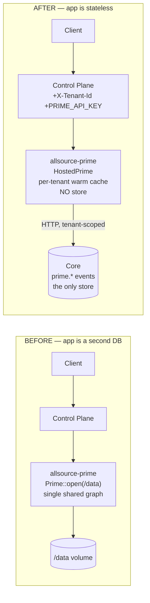
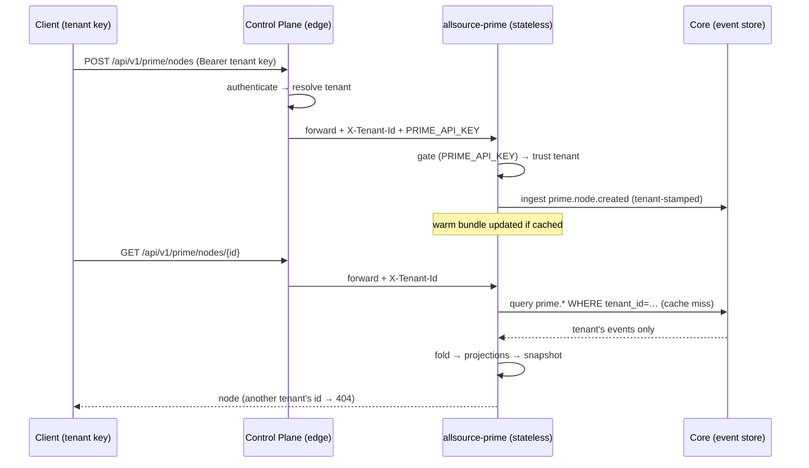

# ADR-020: Prime as a Stateless Engine over Core

**Status:** Accepted — Implemented & deployed to production (2026-06-09)
**Date:** 2026-06-09
**Epic:** t-10f876 · **Proposal/design:** `docs/proposals/PRIME_STATELESS_OVER_CORE.md` · **Prod trace:** `docs/current/PROD_DATA_FLOW_C4.md`

## Context

AllSource Prime is the agent-memory engine (graph + vectors + recall) built on the `prime` crate. In production it shipped as a **standalone `allsource-prime` Fly app** with its own WAL/Parquet store on a `/data` volume.

That gave us a second database. The root cause was a single line — Prime was hard-wired to a concrete, local store:

```rust
// apps/core/src/prime/facade.rs
pub struct Prime {
    core: EmbeddedCore,           // ← concrete in-process WAL/Parquet/DashMap
    /* …projections… */
}
```

The hosted app did `Prime::open(/data)`, so it *was* a Core: one shared, untenanted graph behind a tenant-authenticated edge. Consequences (all verified against the live deployment before this change — see the C4 trace):

- **No tenant isolation.** One shared store; a tenant-authenticated REST surface that, with no key set, accepted unauthenticated writes (`POST /api/v1/prime/nodes` → 201).
- **Four divergent "Prime stores"** (local dev, Core's synced `prime.*` events, the app's `/data` volume, a `#[cfg(feature="prime")]` Core path) with the prod read/write paths pointing at different ones.
- This violated the project's core principle — *Core IS the database; everything else is a stateless service that talks to Core over the network* — which the Query Service and chronis already follow (`RustCoreClient`/`http_core_client.rs` → HTTP → Core).

## Decision

**The hosted `allsource-prime` app holds no durable data. It reads and writes Core over HTTP, the same way the Query Service does. Core's tenant-stamped `prime.*` events are the only store; tenant isolation falls out of querying Core scoped to the caller's tenant.**

Realized as:

1. **`EventStore` trait** (`apps/core/src/prime/event_store.rs`) — Prime's `core` field becomes `Arc<dyn EventStore>` (`ingest`/`ingest_batch`/`query`/`shutdown`). Two impls:
   - `EmbeddedCore` — local, for the stdio dev binary (local-first unchanged).
   - **`HttpCore`** (`http_core.rs`) — reads/writes a remote Core over HTTP, tenant-scoped.
2. **`GraphProjections`** (`projection_bundle.rs`) — builds the full projection set from an event list via `Projection::process`, no backing store.
3. **`TenantProjectionCache`** (`tenant_cache.rs`) — the load-bearing piece: per-tenant warm projections, lazily hydrated from Core on a miss, LRU + TTL eviction. Same shape as Core's own per-tenant warm-set, over HTTP.
4. **`HostedPrime`** (`hosted.rs`) — a distinct, stateless type (so `facade::Prime` and the local path are untouched) composing the above. Full parity: graph, vectors, recall, all REST ops. Every method takes an explicit, gateway-supplied `tenant`.
5. **Routing + auth.** The Control Plane (the public edge) routes `/api/v1/prime/*` to the app, stamping `X-Tenant-Id` + a shared `PRIME_API_KEY` bearer. The app refuses tenant serving unless `PRIME_API_KEY` is configured (so the trusted header can't be spoofed), and gates its hosted REST surface behind that key.

### Before → after



### Request flow (after)



## Consequences

**Positive**
- One durable store (Core). The `/data` volume is gone-in-spirit (mounted-but-unused; removal deferred to a maintenance window).
- **Tenant isolation is structural** — events are queried filtered by `tenant_id`; each tenant gets its own in-memory projection bundle. No partitioning project needed.
- The local-first stdio dev path is untouched (still `EmbeddedCore`).
- No `facade.rs` churn — `HostedPrime` is a separate type.

**Negative / risks**
- **Recall latency vs. statelessness** is the central tradeoff. Cold-building a tenant's vector index from a remote Core is expensive; the per-tenant **warm cache** is what makes it viable. Mitigations: lazy hydrate, keep hot tenants warm, store vectors in the events so rebuilds don't re-embed.
- A write adds a network hop (to Core) instead of a local WAL append — acceptable; the Query Service already writes events to Core on the request path.
- Cache coherence across replicas (start single-machine; add invalidation/sticky routing when scaling).

## Verification (production, 2026-06-09)

Live, through `api.all-source.xyz`:
- no-key REST → **401** (gate live; was 201/open).
- tenant A write + read → **200**.
- tenant B reading A's node → **404** (cross-tenant isolation).
- stats/graph/neighbors correct shapes.

A `HostedPrime` double-apply bug (cold-tenant writes inflated `graph_stats`) was found *during* prod verification and fixed (ADR-immaterial; commit `3c07e6b`): the write path no longer hydrates-then-applies the same event.

## Alternatives considered

- **Enable the `prime` feature on the Core deployable.** Rejected — re-embeds a second Prime store inside the database and recreates the confusion. Core stays the event store; Prime stays a stateless reader.
- **A `PrimeBackend` trait both `Prime` and `HostedPrime` implement** (generic tools/handlers). Rejected for now — a broad refactor of 19 tools + handlers; the separate-dispatch approach kept the blast radius small.
- **Keep the single-store app + partition it by tenant.** Rejected — that *is* the second-DB problem; querying Core by tenant dissolves it.

## Follow-ups (bead t-d843dd)

Drop the unused `prime_data` volume (maintenance window); retire QS GraphFold *after* the app's graph is validated at real-tenant scale; implement projection/provenance in the hosted engine (the gateway routes for those still 404 — a forward feature, not cleanup).
