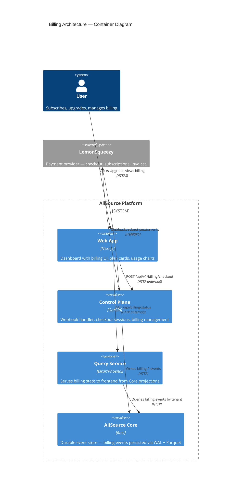
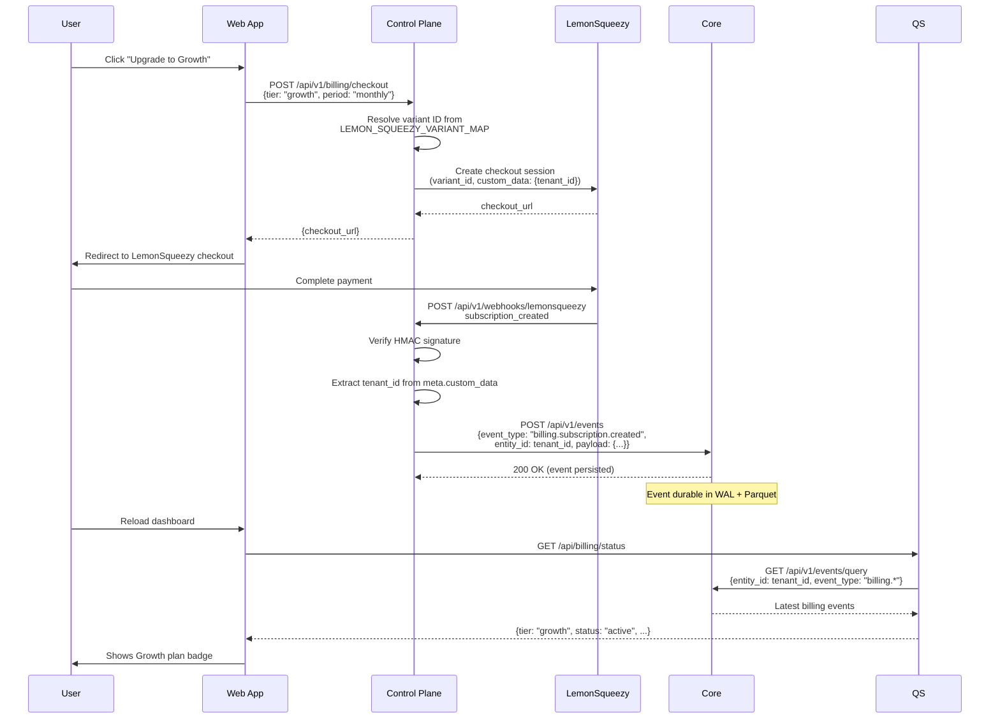
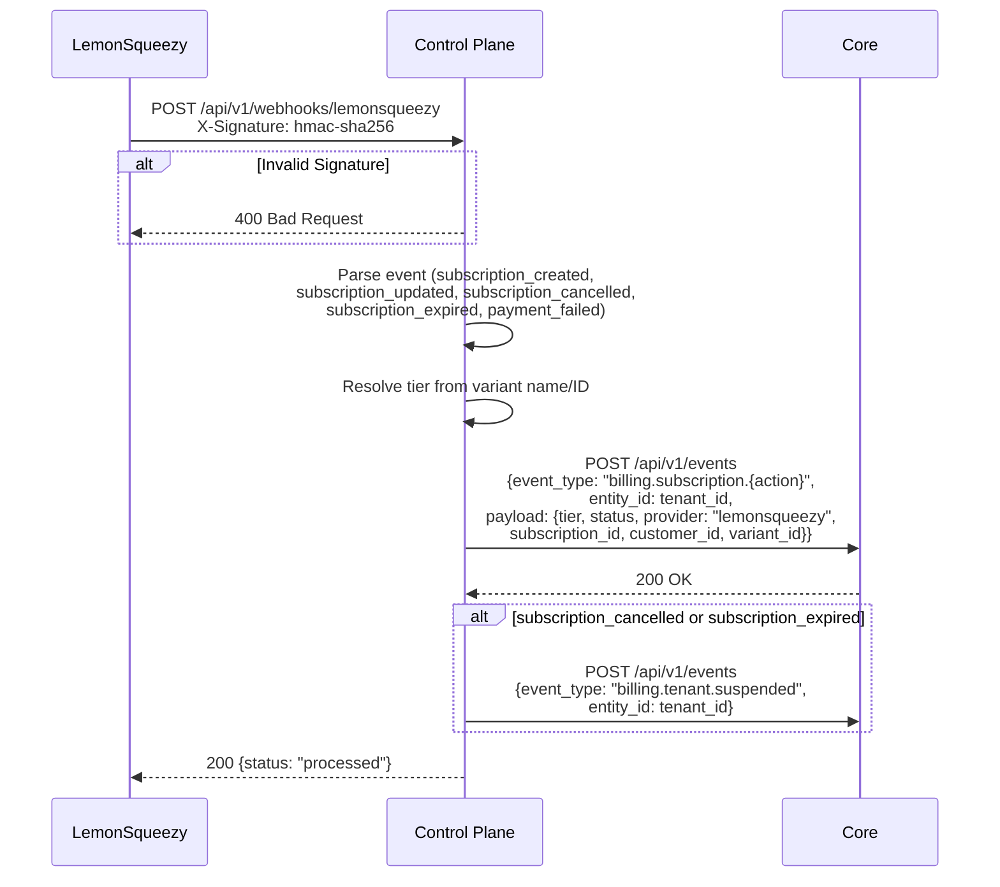

# Billing Architecture

> **Status:** Current architecture as of 2026-03-26. Includes planned event-sourced migration.

## Overview

Billing in AllSource follows the platform's event-sourcing philosophy: subscription lifecycle events are written to Core as durable events, and downstream services derive current state from projections over those events.

**Billing provider:** LemonSqueezy (with Stripe webhook handler also wired).

---

## C4 Level 2: Billing Container Diagram

Shows how billing data flows between containers.



---

## C4 Level 3: Billing Data Flow (Sequence)

### Checkout Flow



### Webhook Processing Flow



---

## Service Responsibilities

### Control Plane (Writer)

The Control Plane is the **only service that talks to LemonSqueezy**. It:

- Receives webhook events and verifies HMAC signatures
- Creates checkout sessions via LemonSqueezy API
- Resolves tier from variant name/ID (configurable via `LEMON_SQUEEZY_VARIANT_MAP`)
- Writes billing events to Core with full payload
- Suspends tenants on cancellation/expiry
- Manages customer portal URLs
- Tracks overage and projected charges

**Env vars:**
- `LEMON_SQUEEZY_API_KEY` — API key
- `LEMON_SQUEEZY_STORE_ID` — Store ID
- `LEMON_SQUEEZY_VARIANT_MAP` — JSON mapping tier names to variant IDs
- `LEMON_SQUEEZY_WEBHOOK_SECRET` — HMAC verification secret

### AllSource Core (Storage)

Core stores billing events like any other event — durable via WAL + Parquet:

- `billing.subscription.created` — New subscription
- `billing.subscription.updated` — Plan change, status change
- `billing.subscription.cancelled` — User cancelled
- `billing.subscription.expired` — Subscription expired
- `billing.payment.succeeded` — Payment confirmation
- `billing.payment.failed` — Payment failure
- `billing.tenant.suspended` — Tenant suspended due to billing

Entity ID = tenant ID. Full audit trail preserved.

### Query Service (Reader)

The QS reads billing state from Core and serves it to the frontend:

- Queries Core for latest `billing.*` events per tenant
- Derives current subscription state (tier, status, quotas, expiry)
- Serves `GET /api/billing/status` to the frontend
- **No LemonSqueezy secrets** — reads from Core only

### Web App (UI)

The frontend calls:
- QS `GET /api/billing/status` — current plan, usage, quotas
- CP `POST /api/v1/billing/checkout` — initiate upgrade (proxied via Next.js)
- CP `GET /api/v1/billing/portal` — customer self-service portal

---

## Tier Configuration

Tiers are resolved at write time by the Control Plane. The mapping is configurable via `LEMON_SQUEEZY_VARIANT_MAP`:

```json
{"growth": "<variant_id>", "enterprise": "<variant_id>"}
```

Each tier has associated quotas (defined in the Control Plane):

| Tier | Events/mo | Queries/mo | Team Seats |
|------|-----------|------------|------------|
| Free | 10,000 | 1,000 | 1 |
| Growth | 100,000 | 10,000 | 5 |
| Enterprise | Custom | Custom | Custom |

---

## Event Schema

Billing events follow the standard AllSource event format:

```json
{
  "event_type": "billing.subscription.created",
  "entity_id": "tenant-abc-123",
  "payload": {
    "subscription_id": "sub_12345",
    "customer_id": "cus_67890",
    "tier": "growth",
    "status": "active",
    "payment_provider": "lemonsqueezy",
    "variant_id": 12345,
    "variant_name": "Growth Monthly",
    "billing_period": "monthly",
    "amount_cents": 9900,
    "currency": "USD"
  }
}
```
