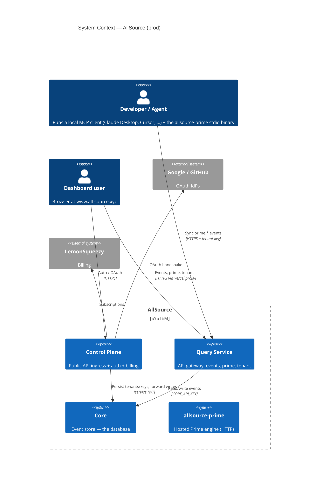
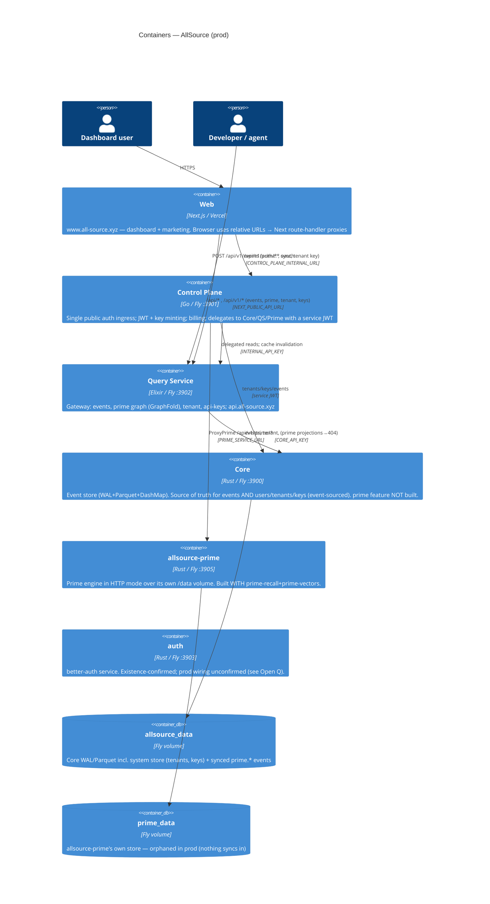
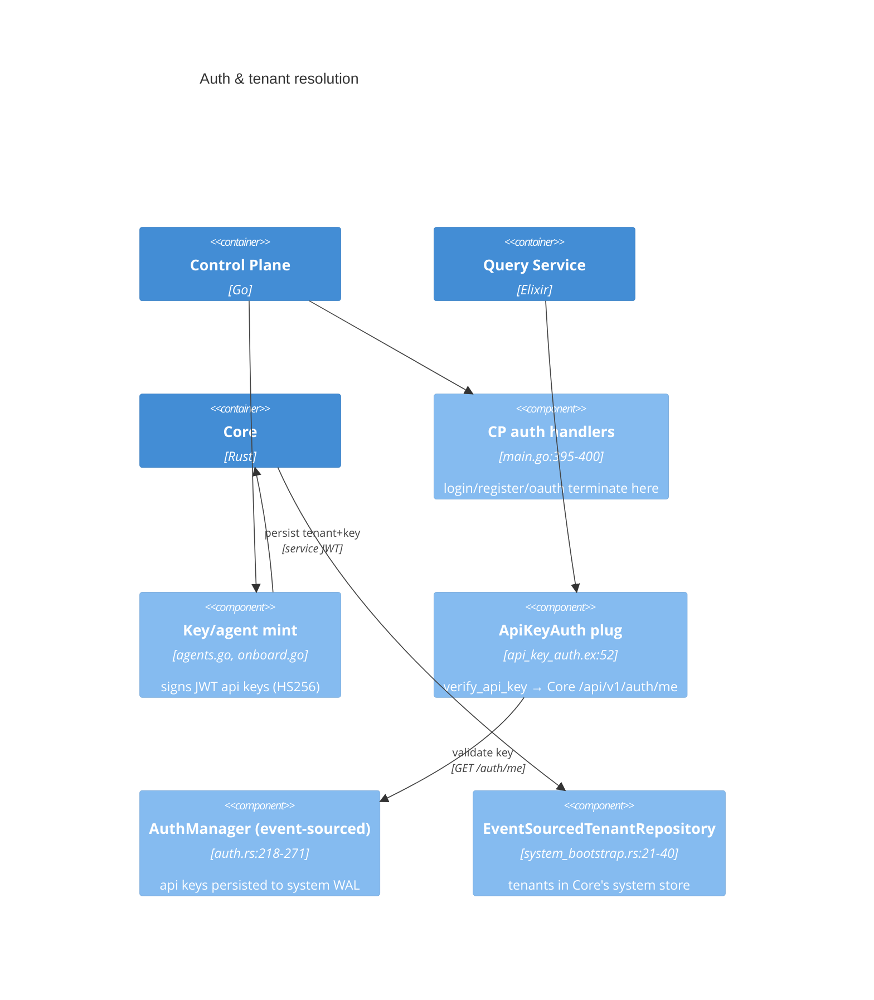
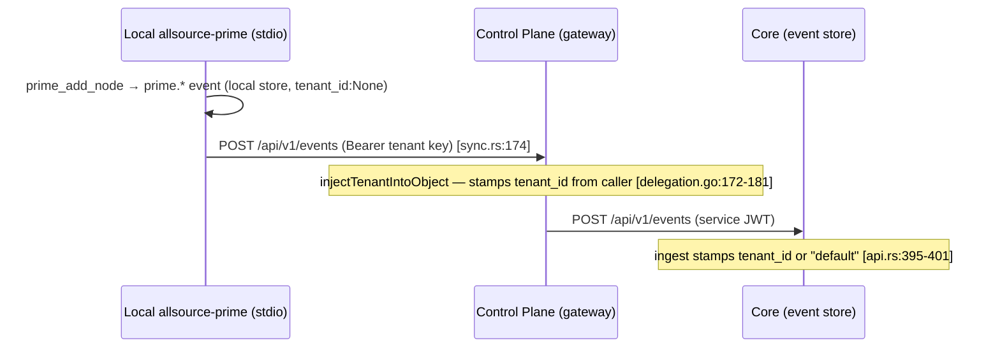
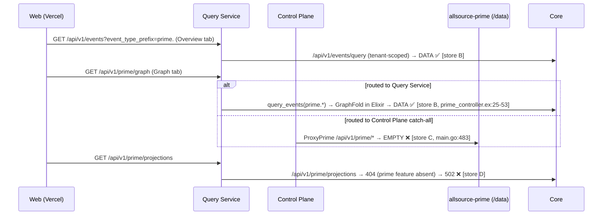

# AllSource — Production Data-Flow (C4-style)

*Date: 2026-06-02 (Prime section superseded 2026-06-09 — see banner)*
*Status: current-architecture trace, code-read (file:line) + verified against the LIVE deployment. Corrects several CLAUDE.md claims (flagged).*

> **⚠️ UPDATE 2026-06-09 — the Prime topology below is OUT OF DATE.** Epic t-10f876 shipped: the `allsource-prime` app is now **stateless** — it holds no store and serves every request tenant-scoped through `HostedPrime` over Core's `prime.*` events. The Control Plane routes `/api/v1/prime/*` to it stamping `X-Tenant-Id` + `PRIME_API_KEY` (the app refuses tenant serving without the key). **Prod-verified:** tenant A write+read → 200, tenant B → 404 for A's node (cross-tenant isolation), no-key → 401. So the "four Prime stores", "single shared seeded graph", and "404ing gateway routes" findings below describe the PRE-migration state. The prime_data volume is mounted-but-unused (removal deferred, bead t-d843dd). Design: `docs/proposals/PRIME_STATELESS_OVER_CORE.md`. The non-Prime sections (CP edge, Core-owns-tenants/keys, request routing) remain accurate.

---

## Live verification (2026-06-02, read-only — nothing deployed/changed)

| Probe | Result | Conclusion |
|---|---|---|
| `GET https://api.all-source.xyz/health` | `{"service":"allsource-control-plane", "persistence":"core", …}` | **The public edge at api.all-source.xyz IS the Control Plane**, not the Query Service. |
| `GET api.all-source.xyz/api/v1/prime/graph` (no auth) | `401 unauthorized` | CP authenticates first, then delegates prime. |
| `GET https://allsource-prime.fly.dev/health` | `{"status":"ok"}` | Standalone Prime app is up and **publicly reachable**. |
| `GET allsource-prime.fly.dev/api/v1/prime/stats` | `total_nodes:17, total_edges:8, event_count:25` (types: feature×5, metric×6, insight×2, decision, policy, service, event) | Store C is **NOT empty** — it holds one shared, seeded/demo-shaped graph. No tenant partition. |
| `POST allsource-prime.fly.dev/mcp` | `404` | The MCP-over-HTTP transport (bead t-dbee53) is committed locally but **not deployed**. |

This resolves the old "Open Q1" empirically: **api.all-source.xyz = Control Plane.** It also corrects an earlier wrong claim that store C was "orphaned/empty" — it is populated with a single shared graph.

---

## Scope & method

This traces what the **production** system actually does — which binaries ship with which features, where data physically lives, and which service answers each request — rather than the intended design. Every claim is grounded in code (`path:line`). Where the code is ambiguous or contradicts CLAUDE.md, it is flagged rather than smoothed over.

The headline: **AllSource is not one "Core + gateway" system. It is six deployables with three trust tiers, four physically distinct Prime stores, and at least three places where the wiring points at a backend that can't answer.**

---

## C1 — System Context

**People & externals**
- **Dashboard user** → `www.all-source.xyz` (Vercel).
- **Developer/agent** → local `allsource-prime` stdio binary + an MCP client; optionally syncs to the hosted backend.
- External: Google/GitHub OAuth, LemonSqueezy billing.

---

## C2 — Containers (deployables)

| Container | Build (features) | Port | Role | Evidence |
|---|---|---|---|---|
| **web** | Next.js, Vercel (no fly.toml) | — | Dashboard + static marketing | `apps/web`, no `fly.toml` per CLAUDE.md |
| **control-plane** | Go `go build` | 3901 | **Single public ingress**, auth/OAuth, JWT+key mint, billing, delegation | `apps/control-plane/main.go:36-38,95-99` |
| **query-service** | Elixir `mix release`, `ALLSOURCE_EDITION=enterprise` | 3902 | API gateway (events/prime/tenant/keys); `api.all-source.xyz` | `apps/query-service/fly.toml:5,15-16,42` |
| **core** | `--features enterprise,analytics` (**no `prime`**) | 3900 | Event store; source of truth for events + system metadata | `apps/core/Dockerfile:112-114`, `Cargo.toml:44-72` |
| **allsource-prime** | `allsource-core` w/ `prime-recall,prime-vectors` | 3905 | Hosted Prime engine, own `/data` | `apps/prime-mcp/Cargo.toml:27`, `fly.toml:10-24` |
| **auth** | Rust `cargo build` | 3903 | better-auth; prod-active status unconfirmed | `apps/auth/Dockerfile:53` |

---

## C3 — Components that matter (where the surprises live)

### Auth / tenant / key ownership — **Core, not PostgreSQL**

- API keys, tenants, and users are all **event-sourced in Core's system store** (`auth.rs:218-271`, `system_bootstrap.rs:21-40`). The Control Plane runs **"Persistence: core (no PostgreSQL)"** (`control-plane/main.go:929`); the Query Service holds only a `TenantCache` invalidated by CP (`internal_controller.ex:61-73`).
- **The mint hands out a signed JWT as the "API key"** (HS256, shared `JWT_SECRET`), not a Core-stored `ask_` row (`control-plane/auth.go:140-157`). Both forms validate at Core's `/me`.

### Trust tiers
1. **Public → Control Plane**: the only service that authenticates end users (`main.go:95-99`).
2. **Control Plane → Core/QS/Prime**: CP signs a 365-day **admin service JWT** (`UserID=control-plane`, `TenantID=system`) and injects the resolved tenant; backends trust CP, never the caller (`main.go:143-163,470-473`).
3. **Query Service → Core**: `CORE_API_KEY` Bearer (`rust_core_client.ex:112-117`). **CP → QS internal**: `INTERNAL_API_KEY` shared secret (`internal_api_key.ex:18-34`).

---

## Dynamic flow 1 — Login (OAuth)

1. Browser → `/api/v1/auth/oauth/:provider` (relative) → Next handler → **Control Plane** (`web/.../api/v1/auth/oauth/[...path]/route.ts`, `CONTROL_PLANE_INTERNAL_URL`).
2. CP ↔ Google/GitHub; CP mints a human session JWT containing identity, tenant, role, and expiry only, then redirects to `/api/auth/callback?token=…`. Long-lived API keys are never embedded in the session token.
3. Web sets `auth_token` httpOnly cookie (`web/.../api/auth/callback/route.ts:55-61`).
4. Subsequent `/api/*` calls send the cookie; each Next proxy translates cookie → `Authorization: Bearer` for the backend (`api/[...path]/route.ts:49-54`). QS `AuthPipeline` builds `current_user` from claims.

## Dynamic flow 2 — Event ingest + Prime sync

- `sync.rs` pushes only `prime.`-prefixed events, **with no `tenant_id` in the body** (`sync.rs:66-73,174-180`).
- **Tenant stamping happens at the Control Plane**, not Core (`delegation.go:172-181`). Core defaults missing tenant to `"default"` (`api.rs:401`). So correct tenanting depends entirely on `--sync-to` pointing at the CP gateway (`https://api.all-source.xyz`). Pointed straight at Core → everything lands under `"default"`.

## Dynamic flow 3 — Dashboard reads memory (the broken one)

---

## The four Prime stores (this is the crux)

| # | Store | Backed by | Written by | Read by | Live in prod? |
|---|---|---|---|---|---|
| **A** | Local dev Prime `~/.prime/memory` | prime-mcp local WAL/Parquet | local MCP tools | local agent (stdio) | per-developer only |
| **B** | **Main Core event store** | `allsource_data` | sync.rs → CP → Core `/events` (tenant-stamped) | **Web Overview tab + QS `prime/graph` GraphFold** | ✅ this is where real memory lives |
| **C** | Hosted `allsource-prime` `/data` | its own REST writes (incl. a seed) | CP `ProxyPrime` + direct public REST | ✅ **live, populated** (17 nodes/8 edges, single shared graph, no tenant partition) |
| **D** | Core-embedded Prime | `#[cfg(feature="prime")]` | n/a | n/a | ❌ feature not compiled into prod Core |

---

## Contradictions & broken wiring (must-read)

1. **Core does not run Prime in prod.** `prime = ["embedded"]` is in no shipped feature set; Core builds `enterprise,analytics` (`Cargo.toml:44-72`, `Dockerfile:112-114`). The `#[cfg(feature="prime")]` router (`api_v1.rs:504`) is compiled out → Core serves **no** `/api/v1/prime/*`.

2. **My own recently-shipped gateway prime routes are broken in prod.** `PrimeController.{index,create,project,provenance}` (beads **t-2ac8 / t-9501 / t-8bf4**) proxy to Core's `/api/v1/prime/*`, which 404s (no prime feature) → 502. They passed tests only because I built Core with `--features prime`. **This is live on `main`.** The `t-061e` comparison-doc claim that projections/provenance are "reachable via REST + SDK" is therefore **false for the shipped images** — true only for a prime-enabled Core build.

3. **Two backends for `/api/v1/prime/graph` — and prod uses C, not B.** QS `PrimeController.graph` materializes the graph from store **B** (GraphFold over `prime.*` events, `prime_controller.ex:25-53`). But the public edge is the Control Plane (live-verified), whose blanket `api.Any("/prime/*path")` (`main.go:483`) forwards `/api/v1/prime/*` to **store C** (the allsource-prime app). So in prod the dashboard graph is answered by C (a single shared seeded graph), while the Overview tab's events query is answered by B (the tenant's real `prime.*` events). **The QS GraphFold path is dead code on the public prime route** — it would only be hit if a client reached the Query Service directly.

4. **Hosted `allsource-prime` app is write-orphaned.** Nothing syncs into its `/data`; sync flows local→Core (B), never into C.

5. **Sync tenanting is gateway-dependent.** No `tenant_id` in the push body; CP injects it. Direct-to-Core sync mis-tenants to `"default"`.

6. **CLAUDE.md is wrong about the metadata store.** It says "PostgreSQL holds users/tenants/API keys" and "Query Service = source of truth for tenants." Code: all three are **event-sourced in Core**; CP/QS are stateless frontends; the Postgres tenant/audit repos exist but are unused/legacy. CLAUDE.md should be corrected.

---

## Open questions for the owner

1. ~~What sits at api.all-source.xyz?~~ **RESOLVED by live probe: the Control Plane.** So prod `/api/v1/prime/*` is `web → CP (api.all-source.xyz) → ProxyPrime → allsource-prime app (store C)`. The Query Service's `PrimeController`/GraphFold (store B) is **not** on the public prime path — QS is an internal delegation target for events, and its prime routes are bypassed in prod.
2. **What is the intended role of the `allsource-prime` app vs. the per-tenant `prime.*` events in Core?** (Earlier B-vs-C framing was wrong — they are not two candidate homes for one feature.) Empirically: store C is a **single, shared, seeded graph with no tenant partition**, served publicly and via CP; store B is per-tenant `prime.*` events synced into Core. Owner to state the correct model — e.g. is C a demo/showcase, a shared-knowledge instance, or the intended (pre-isolation) hosted memory? This determines whether beads **t-10f876 / t-be6360 / t-2ac8 / t-9501 / t-8bf4** are even pointed at the right place.
3. **Is `apps/auth` (Rust better-auth, :3903) live, or has the Control Plane's Go auth superseded it?** Both exist; only CP has prod-wired public auth routes.

---

## Implications for the open Neotoma-parity beads

- **t-10f876** (Prime tenant-isolation) and **t-be6360** (hosted MCP auth) only make sense once Open Q2 is decided — they target store C.
- **t-2ac8 / t-9501 / t-8bf4 / t-061e** assumed Prime-in-Core reachable via the gateway. Per finding #2 that is false in prod. Before any further parity work: decide Q1/Q2, then either (a) enable `prime` on Core (makes B+D converge, the gateway routes start working), or (b) re-point the gateway prime routes at store B's GraphFold pattern (as `graph` already does), or (c) at the hosted prime app C (after isolation). This is a prerequisite, not a detail.
