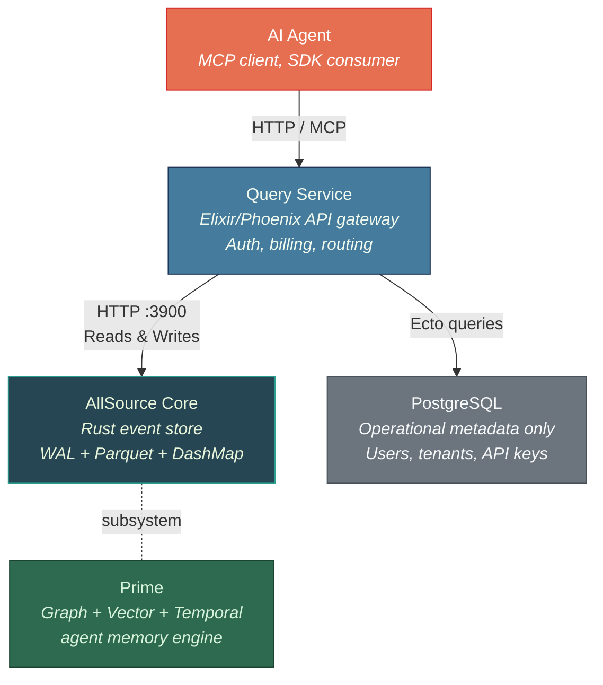
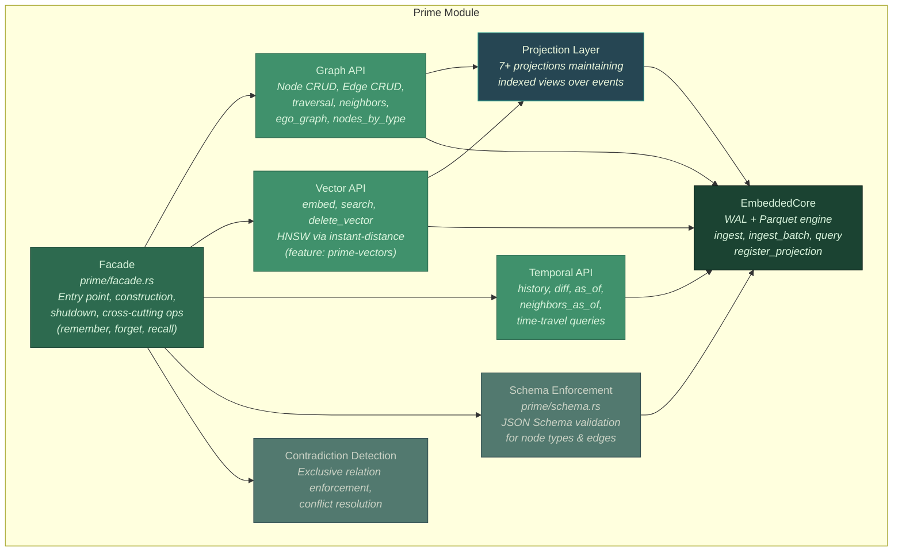
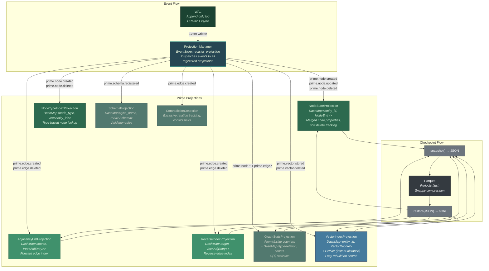
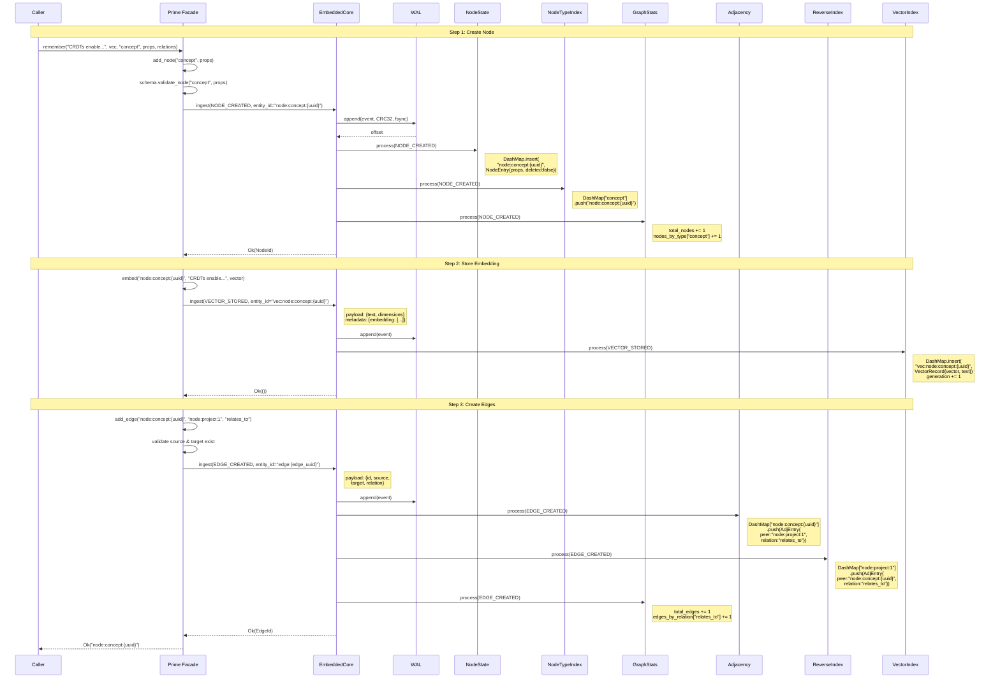

# Prime C4 Architecture Diagrams

Architectural views of AllSource Prime — the unified agent memory engine within AllSource Core. Diagrams follow the [C4 model](https://c4model.com/) using Mermaid.

## 1. Context Diagram

Where Prime sits within the AllSource ecosystem.

**Key points:**
- Prime is a subsystem of Core, not a separate service. It uses Core's WAL, Parquet, and DashMap infrastructure.
- Query Service routes all event operations to Core. PostgreSQL stores only operational metadata (users, tenants, API keys, billing) — never events.
- AI agents interact via the Query Service (HTTP/MCP) or embed Core directly via the Rust SDK.

## 2. Container Diagram

Inside the Prime module — major components and their responsibilities.

**Key points:**
- Facade is the public entry point. Cross-cutting methods like `remember()` and `recall()` live here.
- Graph, Vector, and Temporal APIs handle domain-specific operations.
- All write paths go through EmbeddedCore (`ingest` / `ingest_batch`), which handles WAL durability.
- Projections are registered with EmbeddedCore and process events as they are written.

## 3. Component Diagram — Projection Layer

Each projection, its data structure, and the event types it processes.

**Key points:**
- The Projection Manager dispatches each event to all registered projections. Each projection filters by event type.
- NodeStateProjection and GraphStatsProjection process all node and edge events. Adjacency projections only process edge events. VectorIndexProjection only processes vector events.
- All projections support `snapshot()` / `restore()` for checkpoint-accelerated startup. Snapshots are serialized to JSON and stored alongside Parquet files.
- VectorIndexProjection is unique: its HNSW index is rebuilt lazily on search, not on every event. The DashMap is the source of truth; the HNSW is a derived cache.

## 4. Data Flow Diagram — `prime.remember()`

Full lifecycle of `prime.remember("CRDTs enable replication", vector, "concept", props, [("node:project:1", "relates_to")])`.

**Key points:**
- `remember()` is a convenience method that orchestrates three operations: node creation, vector storage, and edge creation.
- Each operation produces one event that is written to the WAL and dispatched to all relevant projections.
- The NODE_CREATED event updates three projections: NodeState (properties), NodeTypeIndex (type lookup), and GraphStats (counters).
- The VECTOR_STORED event updates VectorIndex. The HNSW index is not rebuilt immediately — it is marked dirty (generation incremented) and rebuilt lazily on the next `search()` call.
- The EDGE_CREATED event updates both Adjacency (forward) and ReverseIndex (reverse) projections, plus GraphStats.
- All events are durable in the WAL before projections are updated. If the process crashes after WAL write but before projection update, projections are rebuilt from the WAL on restart.
