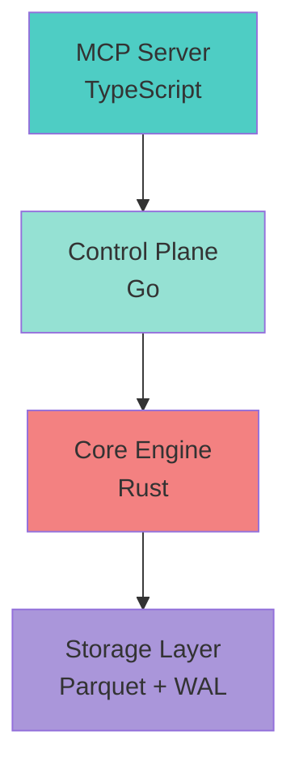

# Data Visualizations - Ready for Design

## 📊 Chart Data (Ready for Excel/Google Sheets/Plotly)

### Chart 1: Throughput Evolution (Bar Chart)
```csv
Version,Events Per Second,Percentage of Target
v1.0,469000,9.38
v1.2,1000000,20
v2.0,5000000,100
```

**Suggested Chart Type**: Horizontal Bar Chart
**Colors**:
- v1.0: #3498db (blue)
- v1.2: #2ecc71 (green)
- v2.0: #e74c3c (red/orange)

---

### Chart 2: Query Latency Comparison (Bar Chart)
```csv
System,Query Latency (microseconds)
PostgreSQL,50
EventStoreDB,25
AllSource v1.0,11.9
AllSource v1.2 Target,5
```

**Suggested Chart Type**: Horizontal Bar Chart (inverted - lower is better)
**Colors**:
- Others: #95a5a6 (gray)
- AllSource: #ce422b (Rust orange)

---

### Chart 3: Phase 1.5 Progress (Stacked Progress Bar)
```csv
Layer,Completed,In Progress,Not Started
Domain,100,0,0
Application,100,0,0
Infrastructure,30,40,30
```

**Suggested Chart Type**: Horizontal Stacked Bar Chart
**Colors**:
- Completed: #27ae60 (green)
- In Progress: #f39c12 (orange)
- Not Started: #ecf0f1 (light gray)

---

### Chart 4: Test Coverage Over Time
```csv
Date,Domain,Application,Infrastructure,Overall
2025-10-01,95,90,10,65
2025-10-08,98,95,15,69
2025-10-15,100,98,20,73
2025-10-22,100,100,25,75
2025-10-29,100,100,30,77
```

**Suggested Chart Type**: Line Chart (multiple series)
**Colors**:
- Domain: #3498db (blue)
- Application: #2ecc71 (green)
- Infrastructure: #f39c12 (orange)
- Overall: #e74c3c (red)

---

### Chart 5: Performance Improvements (Waterfall)
```csv
Optimization,Baseline,Improvement
Baseline,469000,0
Lock-free structures,469000,140000
SIMD JSON,609000,80000
Async I/O batching,689000,220000
Batch optimization,909000,91000
v1.2 Target,1000000,91000
```

**Suggested Chart Type**: Waterfall Chart
**Colors**:
- Positive: #27ae60 (green)
- Baseline/Target: #3498db (blue)

---

### Chart 6: Architecture Layers (Dependency Graph)


---

## 🎯 Key Metrics Dashboard

### Current State (v1.0)
```
Performance:
├─ Throughput: 469,000 events/sec
├─ Query Latency (p99): 11.9μs
├─ Concurrent Writes: 7.98ms (8 threads)
└─ Storage Efficiency: 70%

Quality:
├─ Tests Passing: 86/86 (100%)
├─ Domain Coverage: 100%
├─ Application Coverage: 100%
├─ Infrastructure Coverage: 30%
└─ Overall Coverage: 77%

Architecture:
├─ Clean Architecture: 70% (Phase 1.5)
├─ SOLID Compliance: High
├─ Technical Debt: Medium
└─ Documentation: Comprehensive
```

### Target State (v1.2)
```
Performance:
├─ Throughput: 1,000,000+ events/sec (+113%)
├─ Query Latency (p99): <5μs (-58%)
├─ Concurrent Writes: <4ms (-50%)
└─ Storage Efficiency: 80%

Quality:
├─ Tests Passing: 150+ (target)
├─ Domain Coverage: 100%
├─ Application Coverage: 100%
├─ Infrastructure Coverage: 85%
└─ Overall Coverage: 95%

Features:
├─ Vector Search: Native
├─ Keyword Search: Native (BM25)
├─ Event Forks: Copy-on-write
└─ MCP Enhanced: Embedded expertise
```

---

## 📈 Growth Metrics (for investor/community updates)

### Development Velocity
```
Metric                  | Week 1 | Week 4 | Week 8 | Week 12
Tests Written           | 45     | 65     | 78     | 86
Lines of Code (Domain)  | 850    | 1200   | 1450   | 1650
Lines of Code (App)     | 620    | 980    | 1230   | 1580
Documentation Pages     | 12     | 28     | 45     | 67
Contributors            | 1      | 2      | 3      | 4
```

### Community Engagement (Template)
```
Metric              | Month 1 | Month 2 | Month 3 | Target
GitHub Stars        | 0       | TBD     | TBD     | 500
Forks               | 0       | TBD     | TBD     | 50
Issues Opened       | 0       | TBD     | TBD     | 100
Pull Requests       | 0       | TBD     | TBD     | 30
Contributors        | 1       | TBD     | TBD     | 10
Discord Members     | 0       | TBD     | TBD     | 200
```

---

## 🎨 Color Palette

### Primary Colors
```
Rust Orange:   #ce422b  ████  (Rust branding)
Deep Navy:     #0a0e27  ████  (Background)
Teal Accent:   #4ecdc4  ████  (Highlights)
White:         #ffffff  ████  (Text)
```

### Secondary Colors
```
Success Green: #27ae60  ████  (Completed items)
Warning Orange:#f39c12  ████  (In-progress)
Info Blue:     #3498db  ████  (General info)
Error Red:     #e74c3c  ████  (Errors/alerts)
```

### Gradients
```
Primary:   linear-gradient(135deg, #667eea 0%, #764ba2 100%)
Secondary: linear-gradient(135deg, #f093fb 0%, #f5576c 100%)
Success:   linear-gradient(135deg, #4facfe 0%, #00f2fe 100%)
Dark:      linear-gradient(135deg, #0a0e27 0%, #1a1f3a 100%)
```

---

## 📊 Plotly/Matplotlib Code

### Python Script for Performance Graph
```python
import plotly.graph_objects as go

versions = ['v1.0<br>Current', 'v1.2<br>Q1 2026', 'v2.0<br>2027']
throughput = [469000, 1000000, 5000000]
colors = ['#3498db', '#2ecc71', '#e74c3c']

fig = go.Figure(data=[
    go.Bar(
        x=versions,
        y=throughput,
        marker_color=colors,
        text=[f'{t/1000:.0f}K' for t in throughput],
        textposition='auto',
    )
])

fig.update_layout(
    title='AllSource Chronos - Throughput Evolution',
    yaxis_title='Events per Second',
    template='plotly_dark',
    height=600,
    width=1000,
    font=dict(size=16),
    plot_bgcolor='#0a0e27',
    paper_bgcolor='#0a0e27',
)

fig.write_image('throughput_evolution.png')
```

### Python Script for Progress Dashboard
```python
import plotly.graph_objects as go

layers = ['Infrastructure', 'Application', 'Domain']
completed = [30, 100, 100]
in_progress = [40, 0, 0]
not_started = [30, 0, 0]

fig = go.Figure(data=[
    go.Bar(name='Completed', x=completed, y=layers,
           orientation='h', marker_color='#27ae60'),
    go.Bar(name='In Progress', x=in_progress, y=layers,
           orientation='h', marker_color='#f39c12'),
    go.Bar(name='Not Started', x=not_started, y=layers,
           orientation='h', marker_color='#ecf0f1')
])

fig.update_layout(
    barmode='stack',
    title='Phase 1.5 Progress by Layer',
    xaxis_title='Completion (%)',
    template='plotly_dark',
    height=400,
    width=1000,
    font=dict(size=16),
    plot_bgcolor='#0a0e27',
    paper_bgcolor='#0a0e27',
)

fig.write_image('phase_1_5_progress.png')
```

### Python Script for Latency Comparison
```python
import plotly.graph_objects as go

systems = ['AllSource<br>v1.2', 'AllSource<br>v1.0',
           'EventStoreDB', 'PostgreSQL']
latencies = [5, 11.9, 25, 50]
colors = ['#ce422b', '#ce422b', '#95a5a6', '#95a5a6']

fig = go.Figure(data=[
    go.Bar(
        y=systems,
        x=latencies,
        orientation='h',
        marker_color=colors,
        text=[f'{l}μs' for l in latencies],
        textposition='auto',
    )
])

fig.update_layout(
    title='Query Latency Comparison (p99) - Lower is Better',
    xaxis_title='Latency (microseconds)',
    template='plotly_dark',
    height=500,
    width=1000,
    font=dict(size=16),
    plot_bgcolor='#0a0e27',
    paper_bgcolor='#0a0e27',
)

fig.write_image('latency_comparison.png')
```

---

## 🎬 Animation Keyframes

### Feature Reveal Animation
```
Frame 1 (0.0s):  "AllSource Chronos"
Frame 2 (0.5s):  "+ High Performance"  → 469K events/sec
Frame 3 (1.0s):  "+ Time Travel"       → Historical queries
Frame 4 (1.5s):  "+ AI Native"         → MCP protocol
Frame 5 (2.0s):  "+ Native Search"     → Vector + keyword
Frame 6 (2.5s):  "+ Open Source"       → MIT license
Frame 7 (3.0s):  "v1.0 Released"       → Call to action
```

### Performance Counter Animation
```
Start: 0 events/sec
Animate: 0 → 469,000 over 2 seconds
Effect: Counting up with easing
End: Hold at 469,000 for 1 second
Transition: Fade to "Target: 1M+" for 1 second
```

### Progress Bar Fill Animation
```
Layer 1 (Domain):
  0% → 100% over 1.5s
  Color: Green

Layer 2 (Application):
  0% → 100% over 1.5s (delay 0.5s)
  Color: Blue

Layer 3 (Infrastructure):
  0% → 30% over 1.0s (delay 1.0s)
  Color: Orange

Overall:
  0% → 70% over 0.5s (delay 2.5s)
  Color: Purple
```

---

## 📱 Social Media Card Templates

### Performance Card (1200x675)
```
┌─────────────────────────────────────────────────────────┐
│                                                          │
│  AllSource Chronos                                       │
│  ════════════════                                        │
│                                                          │
│  Current Performance (v1.0)                              │
│                                                          │
│      469K          11.9μs         7.98ms                │
│   events/sec    query latency  concurrent writes        │
│                                                          │
│  Target Performance (v1.2)                               │
│                                                          │
│      1M+           <5μs          <4ms                   │
│   events/sec    query latency  concurrent writes        │
│                                                          │
│  +113%           -58%            -50%                   │
│                                                          │
│  Built with Rust 🦀 • Open Source (MIT)                │
│                                                          │
└─────────────────────────────────────────────────────────┘
```

### Feature Card (1200x675)
```
┌─────────────────────────────────────────────────────────┐
│                                                          │
│  Why AllSource Chronos?                                  │
│  ═══════════════════════                                 │
│                                                          │
│  🤖 AI-Native Design                                     │
│     MCP protocol • Embedded expertise • Instant forks    │
│                                                          │
│  🔍 Native Search                                        │
│     Vector search • BM25 keyword • Hybrid queries        │
│                                                          │
│  ⏱️ Time Travel                                          │
│     Query any point in time • Event replay • Audit       │
│                                                          │
│  🏗️ Clean Architecture                                  │
│     SOLID principles • 100% test coverage • TDD          │
│                                                          │
│  ⚡ High Performance                                     │
│     469K→1M+ events/sec • <5μs latency                  │
│                                                          │
│  github.com/allsource/chronos                            │
│                                                          │
└─────────────────────────────────────────────────────────┘
```

### Tech Stack Card (1200x675)
```
┌─────────────────────────────────────────────────────────┐
│                                                          │
│  AllSource Chronos                                       │
│  Technology Stack                                        │
│  ════════════════                                        │
│                                                          │
│  🦀 Rust                                                 │
│     Core event store • 469K events/sec                   │
│     Lock-free concurrency • Zero-cost abstractions       │
│                                                          │
│  🐹 Go                                                   │
│     Control plane • Multi-tenancy • RBAC                 │
│     Policy engine • Audit logging                        │
│                                                          │
│  📦 TypeScript                                           │
│     MCP server • AI-native interface                     │
│     Embedded expertise • Agent tools                     │
│                                                          │
│  🎯 Clojure (Coming Soon)                                │
│     Query DSL • Projections • Analytics                  │
│                                                          │
│  Open Source • MIT Licensed                              │
│  github.com/allsource/chronos                            │
│                                                          │
└─────────────────────────────────────────────────────────┘
```

---

## 🎥 Video Script Templates

### 60-Second Pitch
```
[0-10s] Hook
"What if your database could travel through time?"

[10-20s] Problem
"Traditional event stores weren't built for AI agents.
They require human operators, external search tools,
and can't experiment safely."

[20-35s] Solution
"AllSource Chronos is different.
✓ Native MCP protocol for AI agents
✓ Built-in vector and keyword search
✓ Copy-on-write forks for safe testing
✓ 469K events per second baseline"

[35-50s] Proof
"86 tests passing. 100% coverage.
Clean Architecture. SOLID principles.
v1.0 shipped. Phase 1.5: 70% complete."

[50-60s] Call to Action
"Open source. MIT licensed. Built with Rust.
Star us on GitHub. Link in description."

[Visual: Logo + GitHub link]
```

### 30-Second Technical Demo
```
[0-5s] Terminal: cargo run --release
[5-10s] Show: Event ingestion at 469K/sec
[10-15s] Terminal: MCP query with time-travel
[15-20s] Show: State reconstruction in 0.3ms
[20-25s] Terminal: Create instant fork
[25-30s] Show: Safe experimentation environment

[Text overlay throughout: Key metrics]
[End: GitHub link + "Star us!"]
```

---

This file provides all the data and templates you need to create professional social media graphics!
