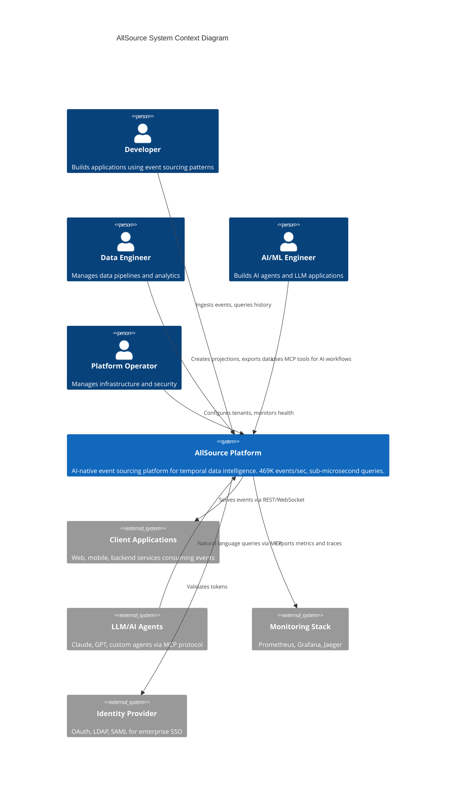
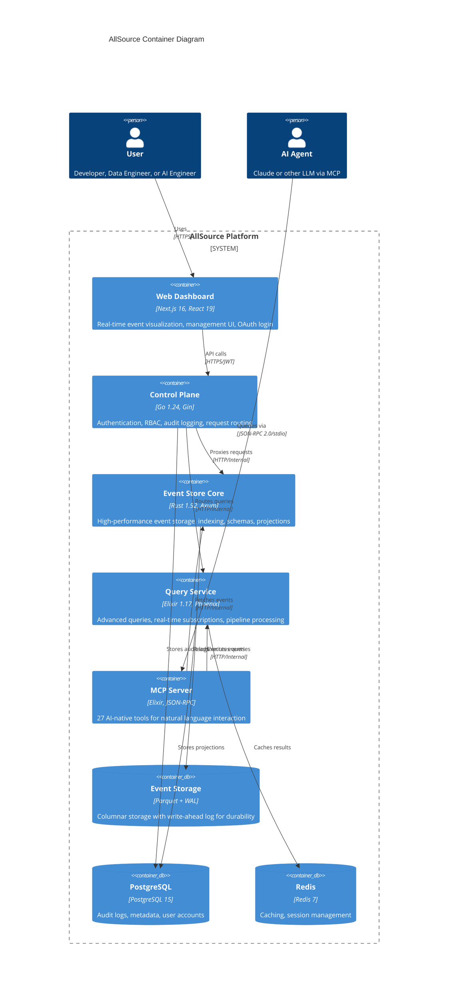
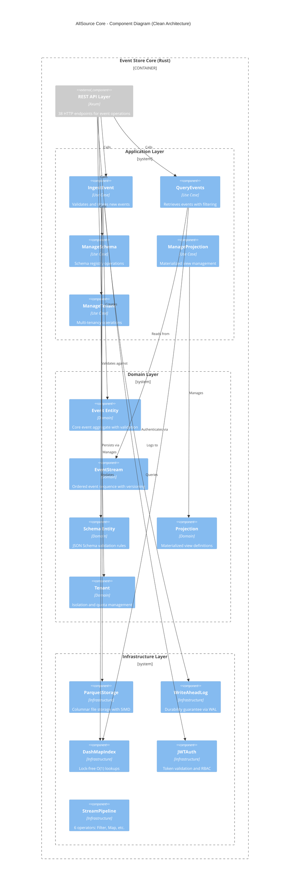
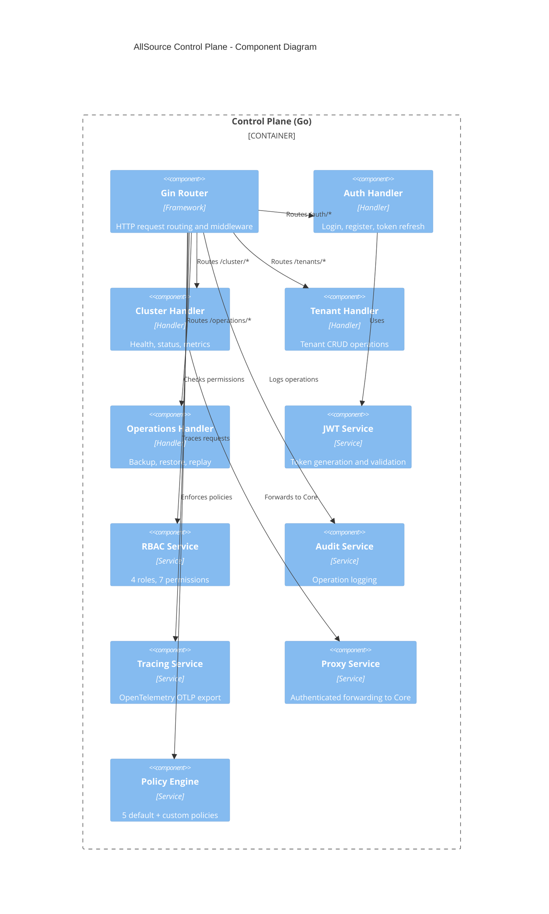
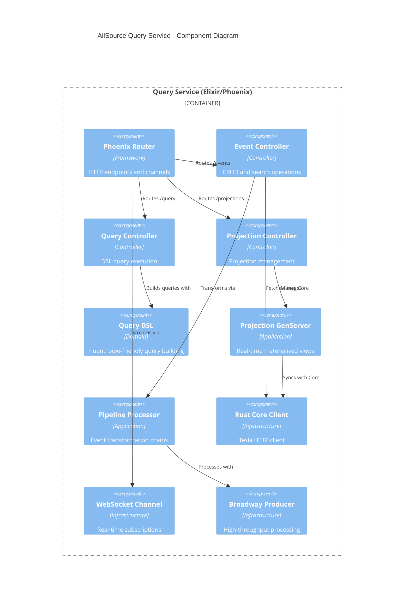
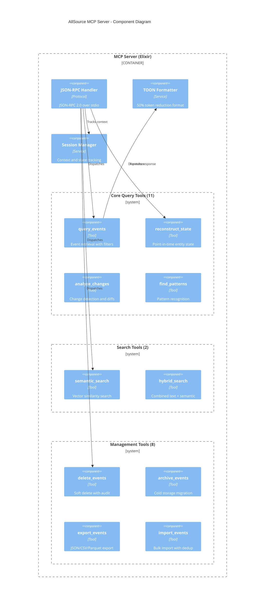
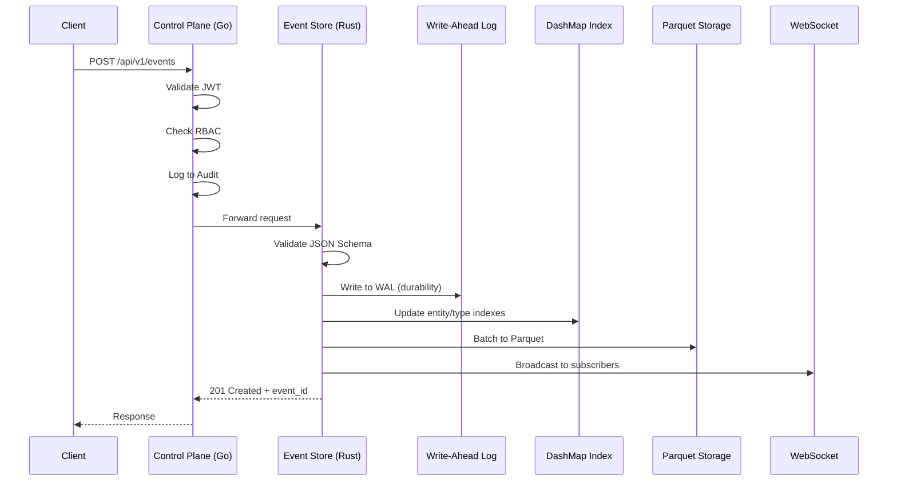
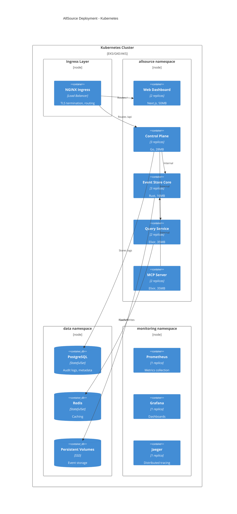

# AllSource C4 Architecture Diagrams (Mermaid)

These diagrams follow the C4 model for visualizing software architecture.
Render in any Mermaid-compatible tool (GitHub, Notion, VS Code, etc.)

---

## Level 1: System Context Diagram

Shows AllSource in the context of its users and external systems.

---

## Level 2: Container Diagram

Shows the high-level containers (services) that make up AllSource.

---

## Level 3: Component Diagram - Event Store Core (Rust)

Detailed view of the Rust core service following Clean Architecture.

---

## Level 3: Component Diagram - Control Plane (Go)

---

## Level 3: Component Diagram - Query Service (Elixir)

---

## Level 3: Component Diagram - MCP Server

---

## Data Flow Diagram: Event Ingestion

---

## Deployment Diagram

---

## Usage Notes

### Rendering These Diagrams

1. **GitHub**: Paste directly in markdown files - renders automatically
2. **VS Code**: Use "Markdown Preview Mermaid Support" extension
3. **Notion**: Paste in code block with "mermaid" language
4. **Mermaid Live**: https://mermaid.live for online editing
5. **Export**: Use mermaid-cli (`mmdc`) for PNG/SVG export

### Customization

- Adjust `UpdateLayoutConfig` for different layouts
- Modify colors via CSS classes or Mermaid themes
- Add/remove components as architecture evolves

### C4 Model Conventions

- **Level 1 (Context)**: System + external actors/systems
- **Level 2 (Container)**: Services, databases, applications
- **Level 3 (Component)**: Internal components of a container
- **Level 4 (Code)**: Class diagrams (not included here)
